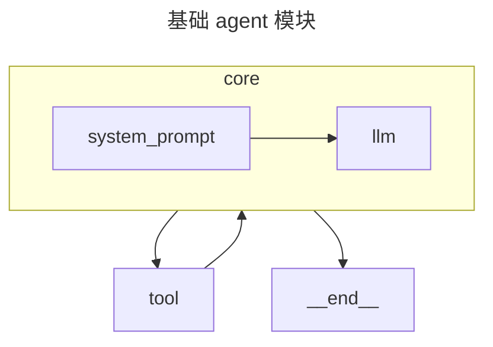
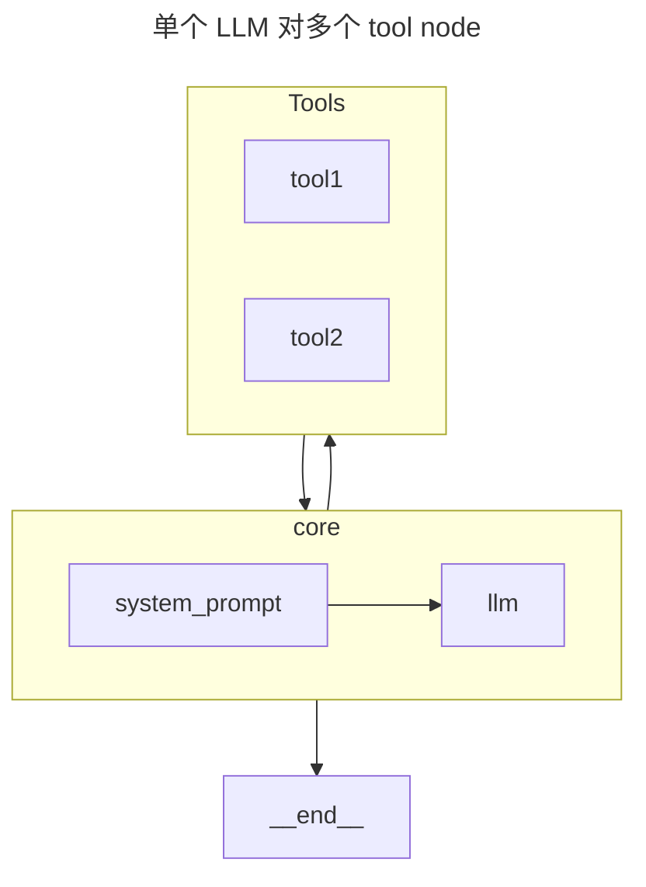

---

---


# langgraph

agent 架构思路

1. 单个 agent 的实现方式
2. 多个 agent 的交互方式
3. 多 agent 系统的实现方式

## 可复用模块整理

1. 基础 agent 模块（没有 memory 调整）



```python
from langchain_core.prompts import ChatPromptTemplate
from langchain_core.pydantic_v1 import BaseModel, Field

# 定义输出格式
class Plan(BaseModel):
    """Plan to follow in future"""

    steps: List[str] = Field(
        description="different steps to follow, should be in sorted order"
    )
   
# 定义 prompt
planner_prompt = ChatPromptTemplate.from_messages(
    [
        (
            "system",
            """your prompt""",
        ),
        ("placeholder", "{messages}"),
    ]
)

# 定义 agent 基础
planner = planner_prompt | ChatOpenAI(
    model="gpt-4o", temperature=0
).bind_tools(tools).with_structured_output(Plan)  
# with_structured_output 就是用 llm bind 以下 plan，然后用 plan 执行了一下 AI 返回的 tool_call 参数。
```


2. 单个 LLM 对多个 tool node




3. 多业务，多 agent 服务用户架构

参考 https://langchain-ai.github.io/langgraph/tutorials/customer-support/customer-support/#utility。

低层采用的 GPT 的 name 机制发送 API，实现多角色对话，比如要实现 researcher 和 chart_generator 对话的话，可以在 API 的 payload 中发送一下 messages:

```python
[{'content': "Fetch the UK's GDP over the past 5 years, then draw a line graph of it. Once you code it up, finish.",
   'role': 'user'},
  {'content': "The search results provide some information about the UK's GDP over the past years, but most of the relevant data is either not in a structured format that can be easily extracted or it is behind a source that requires further access for detailed statistics. To proceed with generating a line graph, we need specific GDP values for each year from 2018 to 2023.\n\nHowever, one of the search results from macrotrends.net does provide specific GDP values for the years 2018 to 2021:\n\n- U.K. GDP for 2021 was $3,141.51 billion, a 16.45% increase from 2020.\n- U.K. GDP for 2020 was $2,697.81 billion, a 5.39% decline from 2019.\n- U.K. GDP for 2019 was $2,851.41 billion, a 0.69% decline from 2018.\n\nWe still need the GDP values for 2022 and 2023 to complete the dataset for the past five years. I will now conduct a further search to find the missing GDP data for 2022 and 2023.",
   'name': 'Researcher',  # 记得提供不同角色的名字
   'role': 'assistant',
   'tool_calls': [{'type': 'function',
     'id': 'call_nvB1wQyQuNeTrOXQZnEtgNDZ',
     'function': {'name': 'tavily_search_results_json',
      'arguments': '{"query": "UK GDP 2022 2023"}'}}]},
  {'content': "The search results did not provide exact figures for the UK's GDP in 2022 and 2023. While there are several references to GDP data, growth rates, and quarterly figures, we do not have the specific annual GDP values in a consistent currency format (such as USD or GBP) that would allow us to compile a complete dataset for the past five years.\n\nTo proceed, we will need to find another source or use a different method to obtain the missing GDP data for 2022 and 2023. If this data is not available, we may not be able to draw an accurate line graph of the UK's GDP over the past five years.",
   'name': 'Researcher',   # 记得提供不同角色的名字
   'role': 'assistant'},
  {'content': "It seems we have hit a roadblock in finding the exact GDP figures for the UK for the years 2022 and 2023. The information provided by the search results does not include the specific data we need. Therefore, we currently do not have the complete dataset to generate a line graph of the UK's GDP over the past five years.\n\nTo proceed, we might need to look for an official statistical release or a comprehensive economic report that includes the GDP figures for 2022 and 2023. If such data can be obtained, we can then use it to create the desired line graph. Without this data, we cannot fulfill the request as specified.",
   'name': 'chart_generator',  # 记得提供不同角色的名字
   'role': 'assistant'}]
```


4. 


## langchain tool call 方式


```python
from langchain_core.pydantic_v1 import BaseModel, Field
from typing import Literal
from langchain_core.tools import tool

@tool
def test(num1: str, num2: str = None):
    """123213

    Args:
        num1 (str): this is a description
        num2 (str): _description_
    Return:
        None
    """
    return
@tool
def test2(num1: str = Field(..., description="First factor"), num2: str = Field(..., description="First factor")):
    """_summary_
    """
    return

class test3(BaseModel):
    """Return product of 'x' and 'y'."""
    x: float = Field(..., description="First factor")
    y: float = Field(..., description="Second factor")

from langchain_core.utils.function_calling import (
    convert_to_openai_tool,
)
tools = [test, test2, test3]
formatted_tools = [convert_to_openai_tool(tool) for tool in tools]
formatted_tools
```

output

```python
[{'type': 'function',
  'function': {'name': 'test',
   'description': '123213\n\n    Args:\n        num1 (str): this is a description\n        num2 (str): _description_\n    Return:\n        None',
   'parameters': {'type': 'object',
    'properties': {'num1': {'type': 'string'}, 'num2': {'type': 'string'}},
    'required': ['num1']}}},
 {'type': 'function',
  'function': {'name': 'test2',
   'description': '_summary_',
   'parameters': {'type': 'object',
    'properties': {'num1': {'description': 'First factor', 'type': 'string'},
     'num2': {'description': 'First factor', 'type': 'string'}},
    'required': ['num1', 'num2']}}},
 {'type': 'function',
  'function': {'name': 'test3',
   'description': "Return product of 'x' and 'y'.",
   'parameters': {'type': 'object',
    'properties': {'x': {'description': 'First factor', 'type': 'number'},
     'y': {'description': 'Second factor', 'type': 'number'}},
    'required': ['x', 'y']}}}]
```

